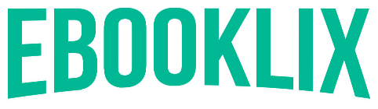

<div align="center">



</div>

<p align="center"> 
  
  
  <a href="https://github.com/rafaelfachinelli">
    
  </a>
  
<p>

<p align="center">
 <a href="#computer-sobre">Sobre</a> •
 <a href="#memo-roteiro">Roteiro</a> •
 <a href="#triangular_ruler-status-do-projeto">Status</a> •
 <a href="#movie_camera-demonstração">Demonstração</a> •
 <a href="#dvd-executar-o-projeto">Executar</a> •
 <a href="#hammer-tecnologias">Tecnologias</a> •
 <a href="#boy-autor">Autor</a> •
 <a href="#page_facing_up-licença">Licença</a>
</p>

---
## :computer: Sobre

...

Projeto desenvolvido durante a **Imersão React** oferecida pela [Alura](https://www.alura.com.br).
A imersão é uma experiência online com muito conteúdo prático e desafios com duração de uma semana para conclusão.

---
## :memo: **Roteiro**

<div align="center">
<details>
<summary>Clique para Visualizar</summary>
	
<details>
<summary>WEB Responsivo</summary>

|      Estado      |     Tarefa    |
|      :---:       |      :---     |
|||

</details>

<details>
<summary>Servidor</summary>

|      Estado      |     Tarefa    |
|      :---:       |      :---     |
|||

</details>
</div>

---
## :triangular_ruler: **Status do Projeto**

<h4 align="center"> 
	👶 Finalizado.
</h4>

---
## :movie_camera: **Demonstração**

https://ebooklix.vercel.app

https://ebooklix.herokuapp.com

<p align="center"><b> :computer: PLATAFORMA WEB </b></p>

<p align="center">
  <kbd>
    
  </kbd> 
</p>

---
## :dvd: **Executar o Projeto**

### :desktop_computer: **WEB Responsivo**

Entre na pasta [`web/`](web/) e execute os seguintes comandos:

<details>
<summary><i>com <b>npm</b></i></summary>

```bash
# Instalar dependências
$ npm install

# Iniciar servidor de desenvolvimento
$ npm start
```

</details>

<details>
<summary><i>com <b>yarn</b></i></summary>

```bash
# Instalar dependências
$ yarn

# Iniciar servidor de desenvolvimento
$ yarn start

```

</details>

> ⚠️ O servidor de desenvolvimento iniciará na porta:3000 - Acesse <http://localhost:3000>

### :globe_with_meridians: **Servidor**

Entre na pasta [`server/`](server/) e execute os seguintes comandos:

<details>
<summary><i>com <b>npm</b></i></summary>

```bash
# Instalar dependências
$ npm install

# Criar banco de dados
$ npm typeorm migration:run

# Iniciar servidor
$ npm dev
```

</details>

<details>
<summary><i>com <b>yarn</b></i></summary>

```bash
# Instalar dependências
$ yarn

# Criar banco de dados
$ yarn typeorm migration:run

# Iniciar servidor de desenvolvimento
$ yarn dev
```

</details>

> ⚠️ O servidor iniciará na porta:3333 - Acesse <http://localhost:3333>

> ⚠️ O Banco de Dados fica salvo em [`server/src/database/database.sqlite`](server/src/database/database.sqlite)

---
## :hammer: **Tecnologias**

As seguintes ferramentas foram utilizadas na construção do projeto:

<div align="center">

|WEB Responsivo|Servidor|
|:---:|:---:|
|||

</div>

---
## :boy: **Autor**

<div align="center">

<a href="https://github.com/rafaelfachinelli">
 
 <br />
 <sub><b>Rafael Fachinelli</b></sub></a>


Feito com ❤️ por Rafael Fachinelli 👋🏽 Entre em contato!

[](https://www.linkedin.com/in/rafaelfachinelli/)
[](https://github.com/rafaelfachinelli)
[](https://rafael-fachinelli.itch.io/)
[](mailto:rafael.fachinelli@fatec.sp.gov.br)

</div>

---
## :page_facing_up: **Licença**

<div align="center">

Copyright © 2020 [Rafael Fachinelli](https://github.com/rafaelfachinelli).<br />
Este projeto é licenciado pelo [MIT](./LICENSE).

</div>
